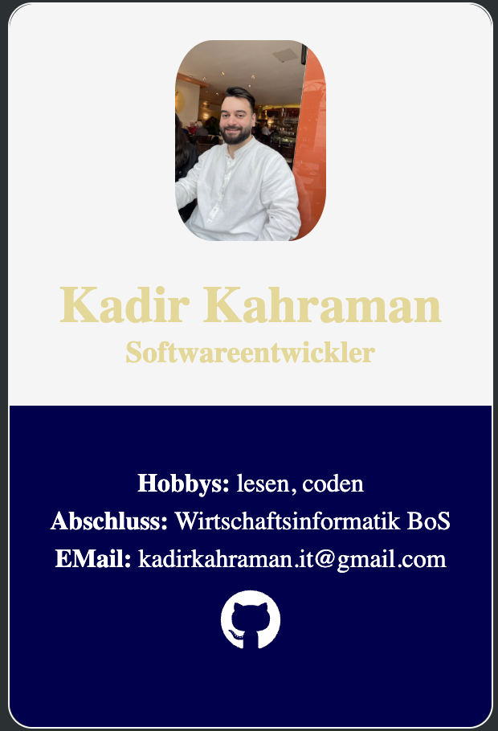

# 💼 Digitale Visitenkarte

Eine moderne und minimalistische Web-Visitenkarte, die meine wichtigsten persönlichen Informationen übersichtlich darstellt. Das Projekt wurde mit HTML und CSS entwickelt und dient als digitales Profil für mein Portfolio.

---

## 📖 Über das Projekt

Dieses Projekt stellt eine digitale Visitenkarte dar und enthält:

- Profilfoto
- Namen und Berufsbezeichnung
- Persönliche Informationen
- Kontaktdaten
- Direkten Link zum GitHub-Profil

Das Ziel des Projekts ist es, grundlegende Frontend-Kenntnisse anzuwenden und eine übersichtliche sowie ansprechende Benutzeroberfläche zu gestalten.

---

## 🚀 Features

- Modernes Karten-Layout
- Zentrierte Darstellung mittels Flexbox
- Individuelles Farbschema
- GitHub-Verlinkung
- Eigenes Favicon
- Übersichtliche Struktur
- Leicht erweiterbar

---

## 🛠️ Verwendete Technologien

| Technologie | Beschreibung |
|------------|-------------|
| HTML5 | Struktur der Webseite |
| CSS3 | Styling und Layout |
| Flexbox | Positionierung der Elemente |
| Git | Versionsverwaltung |
| GitHub | Projektverwaltung |

---

## 📂 Projektstruktur

```text
Projekt/
│
├── index.html
├── style.css
│
└── assets/
    ├── img/
    │   └── profilfoto.JPG
    │
    └── icon/
        ├── busniessCard.svg
        └── github.svg
```

---

## 🖥️ Vorschau

Die Webseite besteht aus einer zentralen Karte mit:

- Profilbild
- Name
- Berufsbezeichnung
- Hobbys
- Abschluss
- E-Mail-Adresse
- GitHub-Link

---

## 🎯 Projektziele

- Entwicklung einer modernen digitalen Visitenkarte
- Vertiefung meiner HTML- und CSS-Kenntnisse
- Praktische Anwendung von Flexbox
- Aufbau eines professionellen Portfolios
- Verbesserung von UI- und Layout-Kompetenzen

---

## 💼 Berufliche Ziele

- Kontinuierliche Weiterentwicklung meiner Fähigkeiten als Softwareentwickler
- Entwicklung moderner und benutzerfreundlicher Webanwendungen
- Anwendung von Best Practices und sauberem Code
- Ausbau meiner Kenntnisse in Frontend- und Full-Stack-Entwicklung
- Aufbau eines aussagekräftigen Entwickler-Portfolios
- Mitarbeit an professionellen Softwareprojekten

---

## 👨‍💻 Autor

### Kadir Kahraman

Softwareentwickler.

---

## 📸 Screenshot



---

## 📄 Lizenz

Dieses Projekt dient Lern- und Portfoliozwecken.